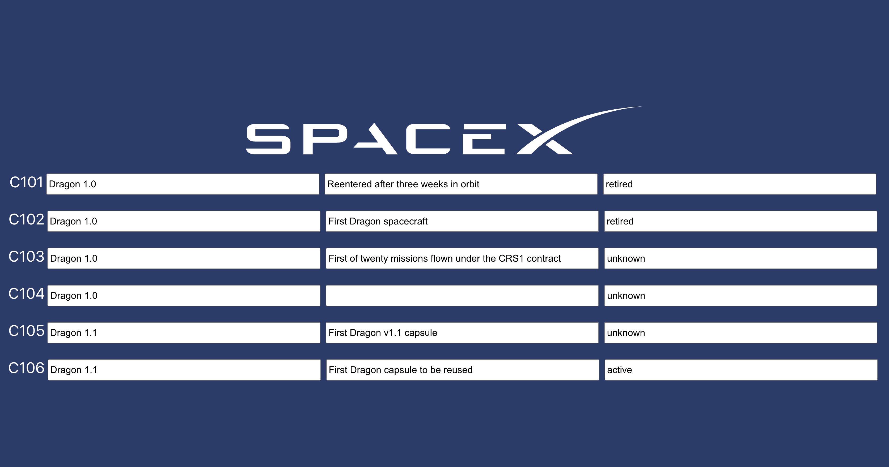

- The application should simply present a table of data from a simple data source 
- The application should save the state of the table using Redux
- The application should allow the user ***update*** a cell within the table
- The application should persist the changed state to Redux
## Available Scripts

In the project directory, you can run:

### `yarn start`

Runs the app in the development mode.\
Open [http://localhost:3000](http://localhost:3000) to view it in the browser.

The page will reload if you make edits.\
You will also see any lint errors in the console.



### `yarn test`

```
Debugger attached.
yarn run v1.16.0
$ env TS_NODE_COMPILER_OPTIONS='{"module": "commonjs" }' nyc --reporter=text mocha
Debugger attached.
Debugger attached.


  Spacex capsule catalog state management tests
state {
  capsules: [
    {
      capsule_serial: 'C101',
      capsule_id: 'dragon1',
      status: 'retired',
      original_launch: '2010-12-08T15:43:00.000Z',
      original_launch_unix: 1291822980,
      landings: 1,
      type: 'Dragon 1.0',
      details: 'Reentered after three weeks in orbit',
      reuse_count: 0
    }
  ]
}
    ✓ Update 1st item 'detail' field
state {
  capsules: [
    {
      capsule_serial: 'C101',
      capsule_id: 'dragon1',
      status: 'retired',
      original_launch: '2010-12-08T15:43:00.000Z',
      original_launch_unix: 1291822980,
      landings: 1,
      type: 'Dragon 1.0',
      details: 'Reentered after three weeks in orbit',
      reuse_count: 0
    }
  ]
}
    ✓ Update 1st item 'type' field
state {
  capsules: [
    {
      capsule_serial: 'C101',
      capsule_id: 'dragon1',
      status: 'retired',
      original_launch: '2010-12-08T15:43:00.000Z',
      original_launch_unix: 1291822980,
      landings: 1,
      type: 'Dragon 1.0',
      details: 'Reentered after three weeks in orbit',
      reuse_count: 0
    }
  ]
}
    ✓ Update 1st item 'status' field


  3 passing (235ms)

Waiting for the debugger to disconnect...
-------------|---------|----------|---------|---------|-------------------
File         | % Stmts | % Branch | % Funcs | % Lines | Uncovered Line #s 
-------------|---------|----------|---------|---------|-------------------
All files    |      90 |       50 |     100 |      90 |                   
 actions.ts  |     100 |      100 |     100 |     100 |                   
 reducers.ts |    87.5 |       50 |     100 |    87.5 | 98-103            
 types.ts    |     100 |      100 |     100 |     100 |                   
-------------|---------|----------|---------|---------|-------------------
Waiting for the debugger to disconnect...
✨  Done in 3.43s.
Waiting for the debugger to disconnect...
```

### `yarn build`

Builds the app for production to the `build` folder.\
It correctly bundles React in production mode and optimizes the build for the best performance.

The build is minified and the filenames include the hashes.\
Your app is ready to be deployed!

See the section about [deployment](https://facebook.github.io/create-react-app/docs/deployment) for more information.
